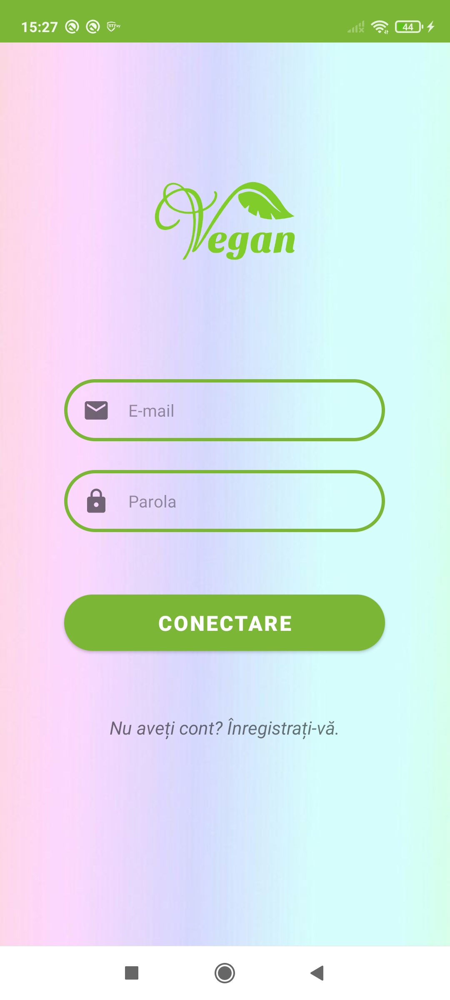
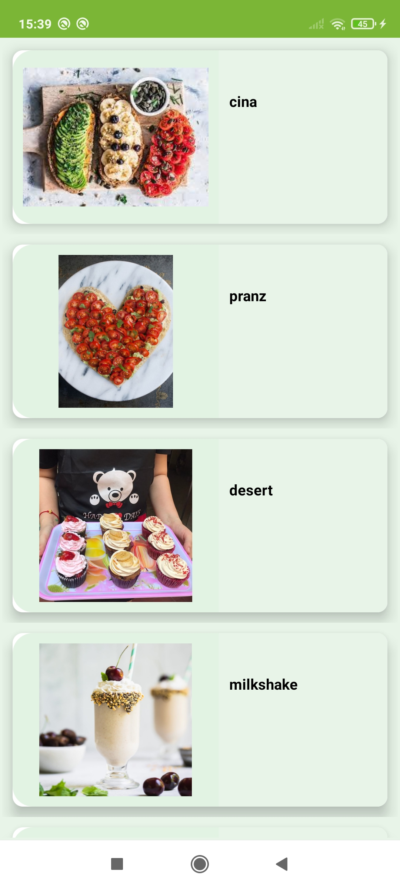
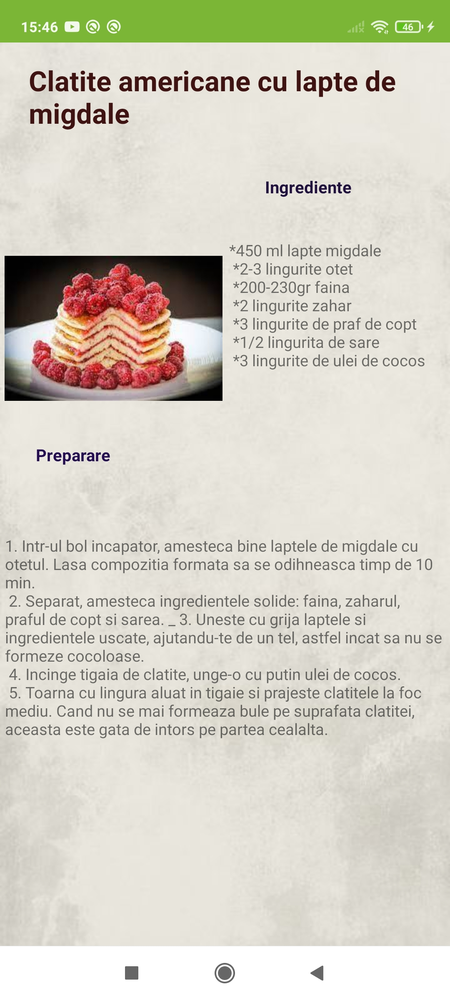
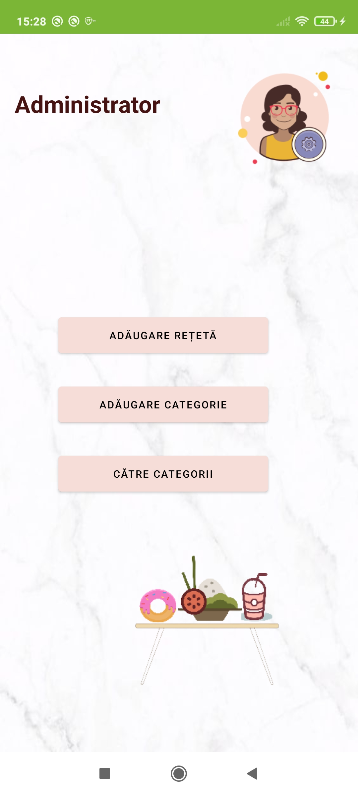
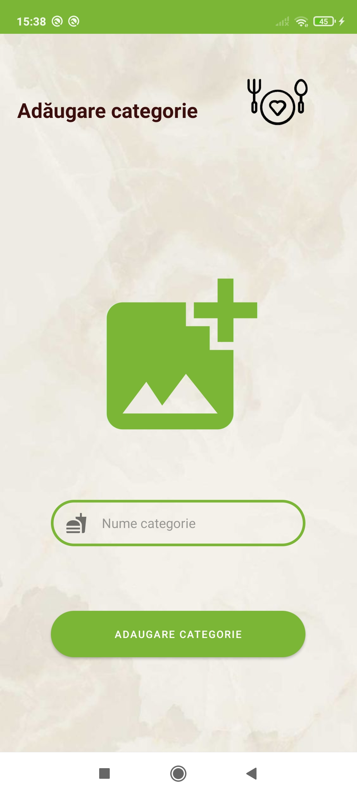
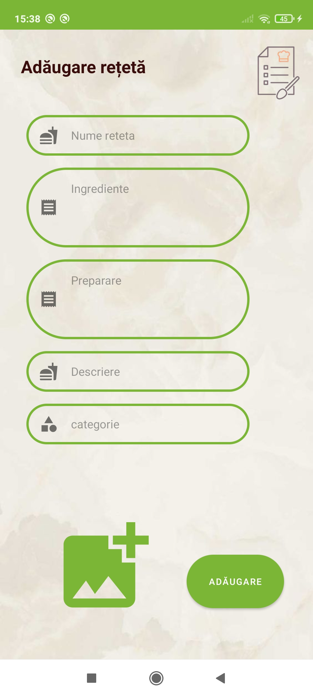

<!--
*** Thanks for checking out the Best-README-Template. If you have a suggestion
*** that would make this better, please fork the repo and create a pull request
*** or simply open an issue with the tag "enhancement".
*** Thanks again! Now go create something AMAZING! :D
-->


<!-- PROJECT SHIELDS -->
<!--
*** I'm using markdown "reference style" links for readability.
*** Reference links are enclosed in brackets [ ] instead of parentheses ( ).
*** See the bottom of this document for the declaration of the reference variables
*** for contributors-url, forks-url, etc. This is an optional, concise syntax you may use.
*** https://www.markdownguide.org/basic-syntax/#reference-style-links
-->
[![Contributors][contributors-shield]][contributors-url]
[![Forks][forks-shield]][forks-url]
[![Stargazers][stars-shield]][stars-url]
[![Issues][issues-shield]][issues-url]


<!-- PROJECT LOGO -->
<br />
<p align="center">
  <a href="https://github.com/EmanuelaIlie/GreenFood">
    
  </a>

  <h3 align="center">GreenFood</h3>

  <p align="center">
    Mobile App that replaces physical cards with smartphones
    <br />
    <a href="https://github.com/EmanuelaIlie/GreenFood"><strong>Explore the docs »</strong></a>
    <br />
    <br />
    ·
    <a href="https://github.com/EmanuelaIlie/GreenFood/issues">Report Bug</a>
    ·
    <a href="https://github.com/EmanuelaIlie/GreenFood/issues">Request Feature</a>
  </p>
</p>


<!-- TABLE OF CONTENTS -->
<details open="open">
  <summary>Table of Contents</summary>
  <ol>
    <li>
      <a href="#about-the-project">About The Project</a>
      <ul>
        <li><a href="#built-with">Built With</a></li>
      </ul>
    </li>
    <li>
      <a href="#getting-started">Getting Started</a>
      <ul>
        <li><a href="#prerequisites">Prerequisites</a></li>
        <li><a href="#installation">Installation</a></li>
      </ul>
    </li>
    <li><a href="#usage">Usage</a></li>
    <li><a href="#contributing">Contributing</a></li>
    <li><a href="#contact">Contact</a></li>
    <li><a href="#acknowledgements">Acknowledgements</a></li>
  </ol>
</details>


<!-- ABOUT THE PROJECT -->
## About The Project

 Badge App is a Mobile Application that replaces physical cards for entering Nokia buildings with your smartphone.

Here's why:
* Harder to forget your phone at home in compare to a physical badge
* It's more convenient, less cards to worry about
* Can manage access for different departments

### Built With

* [Android Studio](https://developer.android.com/studio)
* [Glide](https://github.com/bumptech/glide)
* [Firebase](https://firebase.google.com/)


<!-- GETTING STARTED -->
## Getting Started

To get a local copy up and running follow these simple example steps.

### Prerequisites

* Android studio
  You can download it here: https://developer.android.com/studio

### Installation

You just Clone the repo
   ```sh
   git clone (https://github.com/EmanuelaIlie/GreenFood.git)
   ```

<!-- USAGE EXAMPLES -->
## Usage

Here i will post some screenshots to ilustrate how the app works.

1. Login screen

<a href="https://github.com/EmanuelaIlie/GreenFood">
    
  </a>

2. Easy registration

<a href="https://github.com/EmanuelaIlie/GreenFood">
    
  </a>

3. After login, category

<a href="https://github.com/EmanuelaIlie/GreenFood">
    
  </a>

4. All recipes for selected category

<a href="https://github.com/EmanuelaIlie/GreenFood">
    
  </a>

5. Recipe

<a href="https://github.com/EmanuelaIlie/GreenFood">
    
  </a>

6. Admin profile

<a href="https://github.com/EmanuelaIlie/GreenFood">
    
  </a>
7. Add category
<a href="https://github.com/EmanuelaIlie/GreenFood">
    
  </a>
9. Add recipe
<a href="https://github.com/EmanuelaIlie/GreenFood">
    
  </a>


<!-- CONTRIBUTING -->
## Contributing

Contributions are what make the open source community such an amazing place to be learn, inspire, and create. Any contributions you make are **greatly appreciated**.

1. Fork the Project
2. Create your Feature Branch (`git checkout -b feature/AmazingFeature`)
3. Commit your Changes (`git commit -m 'Add some AmazingFeature'`)
4. Push to the Branch (`git push origin feature/AmazingFeature`)
5. Open a Pull Request


<!-- CONTACT -->
## Contact

Ilie Emanuela-Maria - [emanuela.ilie99@e-uvt.ro](emanuela.ilie99@e-uvt.ro)

Project Link: [https://github.com/EmanuelaIlie/GreenFood](https://github.com/EmanuelaIlie/GreenFood)


<!-- ACKNOWLEDGEMENTS -->
## Acknowledgements
* [icons8](https://icons8.com/icons/set/android)
* [GitHub Pages](https://pages.github.com)


<!-- MARKDOWN LINKS & IMAGES -->
<!-- https://www.markdownguide.org/basic-syntax/#reference-style-links -->
[contributors-shield]: https://img.shields.io/github/contributors/EmanuelaIlie/GreenFood.svg?style=for-the-badge
[contributors-url]: https://github.com/EmanuelaIlie/GreenFood/graphs/contributors
[forks-shield]: https://img.shields.io/github/forks/EmanuelaIlie/GreenFood.svg?style=for-the-badge
[forks-url]: https://github.com/EmanuelaIlie/GreenFood/network/members
[stars-shield]: https://img.shields.io/github/stars/EmanuelaIlie/GreenFood.svg?style=for-the-badge
[stars-url]: https://github.com/EmanuelaIlie/GreenFood/stargazers
[issues-shield]: https://img.shields.io/github/issues/EmanuelaIlie/GreenFood.svg?style=for-the-badge
[issues-url]: https://github.com/EmanuelaIlie/GreenFood/issues
